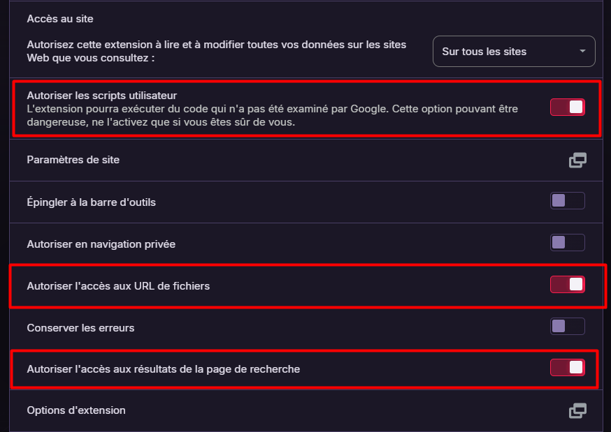

# 🎓 Menu Ressources S3

*Installation en 3 étapes simples*

---

## 🔧 Étape 1 : Installer Tampermonkey

Tampermonkey est une extension qui permet d'exécuter des scripts personnalisés sur les sites web.

**[🔧 Installer Tampermonkey](https://tampermonkey.net)**

---

## ⚙️ Étape 2 : Configurer l'extension

Après installation, configurez Tampermonkey avec ces paramètres recommandés :

*Interface de configuration de l'extension*

**[▶️ Tutoriel vidéo rapide](https://youtu.be/YOUR_TUTORIAL_ID)**

---

## 📥 Étape 3 : Installer le script Menu S3

Une fois Tampermonkey configuré, cliquez sur le bouton ci-dessous pour installer automatiquement le script du menu S3.

**[📥 Installer le Script Menu S3](https://raw.githubusercontent.com/MickaelFlores/menu-s3-webetud/main/menu-s3.user.js)**

> **✅ C'est tout !**  
> Le menu apparaîtra automatiquement sur toutes les pages Webetud de l'IUT Blagnac.

---

## 🔄 Mises à jour automatiques

Le script se mettra à jour automatiquement. Vous n'avez rien à faire !  
En cas de problème, contactez-nous ou consultez la documentation.
